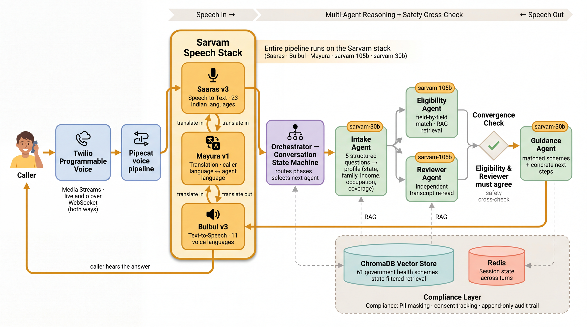

# Vaidya

[](https://github.com/rajdeepmondaldotcom/vaidya/actions/workflows/ci.yml)

**Call one number, speak any Indian language, answer five questions, and find out which government health schemes you qualify for, what to bring, and where to go.**

*Vaidya* (वैद्य) is the old word for the village healer, the person you went to when you didn't know what was wrong or where to go. Not a specialist. A guide who listened, understood your situation, and told you the next step in words you understood. That is the job here. Not diagnosis, not treatment. Discovery.

## Two real calls, and a number you can dial

The two recordings in [`demo/`](demo/) are real calls to a line that is live right now, trimmed for dead air and nothing else.

- [`demo/hindi-vaidya-call.wav`](demo/hindi-vaidya-call.wav), a caller answering in Hindi.
- [`demo/bengali-vaidya-call.wav`](demo/bengali-vaidya-call.wav), a caller answering in Bengali.

You can also dial it yourself, with one caveat covered below. The line runs on a Twilio trial account, and a trial line only connects calls from numbers verified on the account. So **+1 775 372 2354** won't pick up for a number I haven't verified, and verifying one takes about two minutes. The recordings are the full experience for anyone. To hear it live, send the number you'll call from and I'll open the line to it. Either way it answers in Hindi and switches to your language the moment you speak.

## What this solves

India already has the schemes. PM-JAY alone covers ₹5 lakh per family per year, and there are more than thirty state variants stacked on top of it. Around 55 crore people are eligible. Roughly 18 crore have never enrolled.

The gap isn't policy. It's discovery. The people who need it most are the least able to go find it. No literacy, no internet, no free afternoon to decode an English PDF on a government portal. So the benefit sits there, real and unclaimed.

Vaidya takes the screen out of the way. You make a phone call, in your language, and you hang up knowing what you can get and where to go for it. No app, no signup, no reading.

Scope is the rule that held the whole way through. Vaidya is a first point of contact, not an authority. It says *mil sakti hai*, you may be eligible, never *you are eligible*. The final word belongs to the Jan Seva Kendra. The system advises, the human decides. That single constraint drove more of the architecture than anything else.

## How it works, and why it's built this way

A single spoken answer travels through speech recognition, a deterministic router, up to four agents, a safety check, translation if needed, and speech synthesis. The design falls out of that path.



**The orchestrator is plain Python.** It's a `match`/`case` state machine over seven conversation phases, and it makes every routing decision in well under ten milliseconds. No model in the routing loop. A language model is non-deterministic by design, and the control flow of a system that tells people what healthcare they qualify for cannot be. The routing has to be the same every time, debuggable, and unit-testable. So the orchestrator owns what happens next, deterministically, and the agents do their thinking inside the lanes it draws. The model is pulled in only where there's real judgment to make.

**The agents hold the judgment.** Intake asks the five questions one at a time and turns spoken answers into structured fields, even when the caller answers out of order or mixes two languages in one sentence. Eligibility matches that profile field by field against the scheme corpus. Reviewer does something different and, at scale, more important: it throws away the structured fields and re-reads the entire raw transcript, hunting for what field matching misses. Guidance turns the agreed result into a short spoken answer plus the concrete next step.

**The two-check safety pattern comes from one number.** At 55 crore people, a two percent false-positive rate sends 1.1 crore of them to an enrolment desk to be turned away. That is the failure the design targets. Eligibility is decided twice, two different ways. The Eligibility agent does structured field matching. The Reviewer agent reads the whole transcript independently and catches what a field pass slides past: an employer-insurance mention dropped in a code-mixed aside three turns ago, a government job disclosed in passing, an answer that contradicts an earlier one. Both run in parallel. The result is spoken only when they agree. When they disagree, the system resolves conservatively, "you may qualify, confirm at the Jan Seva Kendra," and logs both reasoning traces. For a healthcare advisor the false positive is the expensive error, so a second model pass drives it toward zero. That is the line between something that demos well and something you can put in front of the country.

**The two Sarvam chat models are routed by what each step needs.** The slow, careful work, eligibility and the reviewer, runs on `sarvam-105b` for accuracy. The fast, conversational work, intake and guidance, runs on `sarvam-30b` for speed. Saaras handles speech in, Bulbul handles speech out, and Mayura translates when the caller's language differs from the language the agents reason in. Each model does the job it's best at, and the routing is a config decision, not a code change.

**Latency is hidden, not faked.** The moment intake has gathered enough to evaluate, eligibility and the reviewer start running in the background while the caller is still answering the last questions. By the time they finish talking, the answer is usually already computed. A fingerprint of the profile guards it: if a later turn changes a field the result depends on, the speculative pass is thrown away and recomputed, so this only ever buys latency, never correctness.

**Language detection nearly sank the whole thing.** The bot opens in Hindi and is supposed to switch to the caller's language from their first answer. On a real call, a Bengali caller got an English bot the whole way through. The production logs showed why: Saaras tagged the caller's short, place-name-heavy first answer ("Ami Paschim Banga thaki, Howrah") as `en-IN`, the code trusted that language tag, switched the voice to English, and locked. The STT language tag is unreliable on short regional speech, but the script Saaras transcribes into is not. So the code stopped trusting the tag and started reading the script. A Bengali, Devanagari, Tamil, or Telugu transcript is that language, and English is chosen only when the words actually look English. On an ambiguous answer it stays in the current language and stays unlocked, so the next clean answer corrects it. Trusting the script over the tag is the difference between a Bengali caller getting Bengali and getting dropped into English.

**Eligibility is closed-book on purpose.** Every scheme's rules are already in the prompt, so external retrieval is off. It was adding ten to thirty seconds per batch and, worse, occasionally tempting the model to override the curated scheme data with stale public text. The candidate set is narrowed first with retrieval over a vector store, only the schemes that could plausibly apply for that caller and state, then evaluated in small batches with high parallelism. Many small `105b` calls running concurrently finish in roughly one call's time. One big batch is a single long call that risks the per-call timeout and then retries. Small and parallel won, measurably.

**Intake had to survive bad STT, which took two fixes.** First, Saaras splits slow natural speech into two to four fragments, each with sentence-final punctuation, so a naive flush acts on half an answer and re-asks. The turn debounces on transcript quiet and merges the fragments into one utterance before running. Second, and subtler: once the extractor reports every field on every turn, a single mis-hear can overwrite a field it shouldn't own. The smoking gun was Saaras hearing the common Hindi "dihaadi mazdoori" (daily-wage labour) as "Bihari mazdoori," which made the occupation turn quietly rewrite the state from Rajasthan to Bihar and surface the wrong state's schemes. The text eval never sees this, because it types "dihaadi" cleanly. The fix is field stickiness: a numbered question authoritatively sets only its own field, and a field owned by another question is filled only when still empty, never overwritten. The confirmation read-back is the human safety net on top of that.

**The spoken results are deliberately short.** A low-income caller can match fifteen to nineteen schemes. Reading all of them by their full names runs past a minute and is useless on a phone. So guidance speaks the few most relevant schemes by their recognizable short names, offers to text the full list, and stops. Spoken output is deterministic and cacheable rather than free-form model text, because unique generated speech misses the TTS cache, lags the voice-and-language switch, and comes out garbled. Boring and cached beats clever and broken.

**No LangChain, no CrewAI.** The orchestration is hand-written because the routing is deterministic and the failure modes are specific to this domain. A framework would have hidden the exact control flow that most needed reasoning about, and added a dependency surface to debug anyway.

## How it's deployed

This runs as a live phone line, not a notebook.

**Railway** runs the FastAPI app, Redis for session state, and ChromaDB for the scheme vectors, all from a Dockerfile with the embedding model baked into the image so a cold start never waits on a download. Sessions live in Redis with a short TTL. Early on, a dropped call mid-intake would let a caller ring back and resume, which sounds fine until a caller who had already finished rang back and got dropped into the dead tail of the old call. Recovery now resumes only a call interrupted mid-intake, and every other state starts fresh. Small rule, real silent-call bug fixed.

**Twilio** carries the call. When someone dials, Twilio hits a webhook on the app, gets back TwiML that opens a bidirectional Media Stream, and streams the live audio to a WebSocket. A Pipecat pipeline wires that stream to Saaras for speech in and Bulbul for speech out, with the orchestrator and agents in the middle of the loop. The caller hears a conversation.

**A note on the number, since it's American.** The right way to run this in India is a local number from a provider like Exotel, or Twilio's India route. Both need a registered business and KYC I don't have as an individual, and the India path carries regulatory paperwork I can't clear on my own yet. Plivo was the same story: I tried it and couldn't get it working end to end for this setup, the same class of business-account and India-onboarding friction. So the entire telephony path runs on Twilio's free trial, deployed end to end. The trial leaves three fingerprints, all of them the trial's doing and not the system's: a US number, a short "trial account" message before Vaidya answers, and calls only from numbers verified on the account. Everything after that message, the live audio, the language switch, the reasoning, the spoken answer, is real and running in production. A paid account clears all three at once: an Indian number, no preamble, open to any caller. Nothing else in the system changes.

## The schemes

| Scheme | Cover | Who qualifies |
|--------|-------|---------------|
| PM-JAY | ₹5L / family / year | SECC-2011 families, income under ₹2.5L |
| PM-JAY 70+ | extra ₹5L | anyone aged 70 or above, any income |
| Chiranjeevi (Rajasthan) | ₹25L / family / year | NFSA families free, others ₹850/year |
| Swasthya Sathi (West Bengal) | ₹5L / family | every WB resident, no income test |
| MJPJAY (Maharashtra) | ₹5L / family / year | ration-card holders |
| PMSBY | ₹2L accidental | ages 18 to 70 with a bank account, ₹20/year |
| ESIC | comprehensive | salaried workers under ₹21K / month |

That's a sample. The full corpus is 61 schemes, 29 central and 32 state, covering every state and union territory. Each one is a validated JSON file with its real eligibility rules, exclusions, and enrollment steps, human-readable and git-tracked, so a domain reviewer can check a scheme without reading code. The data is the part most likely to drift and most in need of non-engineer review, so it lives as data, not as logic. At runtime Vaidya evaluates every scheme that could apply to the caller: the central set plus their state's, or the whole registry when the state isn't known yet.

## The stack, the compliance, and how it's tested

Python 3.11 and FastAPI. The Sarvam SDK for `sarvam-105b` and `sarvam-30b`, Saaras v3, Bulbul v3, and Mayura v1. ChromaDB for state-filtered retrieval, Redis for sessions. Aadhaar, phone, and PAN are masked before anything is stored, consent is tracked, the audit trail is append-only, and one DELETE endpoint wipes a caller's data for a DPDP-Act request. A system handling health and identity data for vulnerable people has to treat that as a first-class concern, not a checkbox.

More than a thousand unit and integration tests run on every push, behind `ruff`, `mypy --strict`, and a coverage floor. On top of those, an 81-scenario evaluation suite scores the things that matter end to end: per-scheme accuracy, exclusion logic, identical results for the same profile across languages, adversarial inputs like prompt injection and Aadhaar probing, and the case where the reviewer catches what eligibility missed. The methodology is in [docs/EVALUATION.md](docs/EVALUATION.md), the design in [docs/ARCHITECTURE.md](docs/ARCHITECTURE.md), and a guided walkthrough in [docs/DEMO.md](docs/DEMO.md).

On a representative slice across all ten voice languages, precision was 100 percent: the advisor never recommended a scheme the caller was ineligible for, and all four exclusion and prompt-injection cases correctly withheld PM-JAY. State-scheme recall, the scheme the caller actually enrolls in, was about 100 percent. The known gap is the central PM-JAY umbrella label: in states that deliver PM-JAY through their own scheme, the system surfaces the state vehicle the caller signs up for and only inconsistently also names the central label. That is a modeling nuance, not a safety failure, and it is the next thing to fix. The orchestration adds under ten milliseconds per routing decision. End-to-end time is dominated by Sarvam API response under load, which is variable. The raw API latency is not fast; on the voice path, the speculative pre-compute and the spoken fillers cover it.

## Run it without a phone

Clone it, point it at a Sarvam key, and drive a full conversation in text.

```bash
git clone https://github.com/rajdeepmondaldotcom/vaidya.git && cd vaidya
pip install -e ".[dev]"
cp .env.example .env          # add your SARVAM_API_KEY
docker compose up -d redis chromadb
python scripts/seed_knowledge.py
make run
```

Then send a whole multi-turn call as text, no audio needed:

```bash
curl -X POST http://localhost:8000/simulate/text \
  -H "Content-Type: application/json" \
  -d '{"language":"hi-IN","turns":[
    "Mujhe sarkaari health scheme ke baare mein jaanna hai",
    "Main Rajasthan mein rehta hoon",
    "Ghar mein 5 log hain",
    "Daily mazdoori karta hoon",
    "Nahi, koi insurance nahi hai",
    "Bachche ke liye ilaaj chahiye"]}'
```

A Sarvam key is free at [dashboard.sarvam.ai](https://dashboard.sarvam.ai), the LLM endpoints cost nothing, and text mode uses only the LLM, so the conversation above runs for ₹0.

## What's next

Now: 61 schemes across every state and UT, 23 languages, text simulation, and real voice calls over Twilio. Next: an automated refresh of the scheme corpus, WhatsApp through Samvaad, and verification against the NHA API. After that, a per-state deployment that runs the whole pipeline locally and air-gapped for health departments that need it. The same shape generalizes past healthcare, to pensions, agriculture subsidies, and scholarships, which all share the same discovery problem.

## Why I built this

This problem is close to me. In 2019, in college, I tried to build something that voice-dubbed English lectures into Indian languages: Andrew Ng, Gilbert Strang, the courses that carried me through my own degree. The idea was to get them to the under-resourced schools and colleges around me, where the lectures existed but the language didn't. The technology wasn't ready then. I spent a lot of Claude credits keeping it alive, and it eventually failed, but the problem never left me: good knowledge exists, and the people who need it most can't reach it because of language.

Vaidya is that same gap from another direction, which is why what Sarvam is building genuinely impresses me. The stack that wasn't there in 2019 exists now. I bought a few thousand rupees of Sarvam credits and put this together over a weekend, mostly to see whether the idea finally works. It does, and I'd love to keep going.
